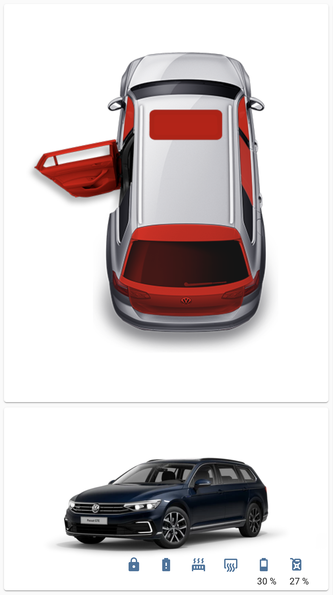

# Install

```
resources:
    url: ....
    type: js
```

## Configure

```yaml
type: "custom:carnet-card"
car_id: passat_gte_2020 # your car identifer in home assistant (e.g. binary_sensor.passat_gte_2020_climatisation_without_external_power)
slice_url: https://images.portal.volkswagen-we.com/slices/passat_variant_gte_pa/passat_variant_gte_pa # either you can extract this url from the logs of the homeassistant-volkswagencarnet plugin or use the dev tools and debug the portal.volkswagen-we.com website.
```

# Development

1. Clone Repo
2. Run dev server `http-server --cors -c-1 -p 8000`
3. Open Home-Assistant -> Settings -> Lovelace Dashboards -> Ressources -> http://<your-ip>:8000/carnet-card.js

# Example:


